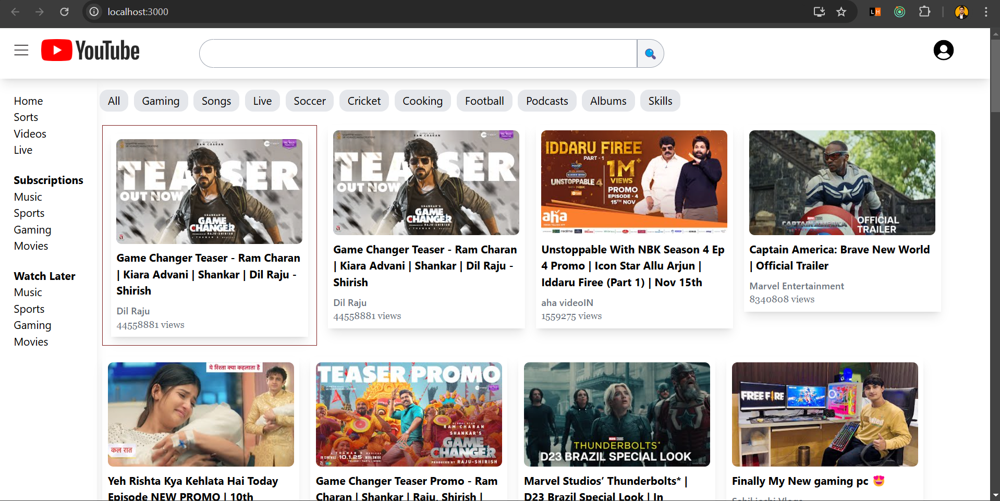
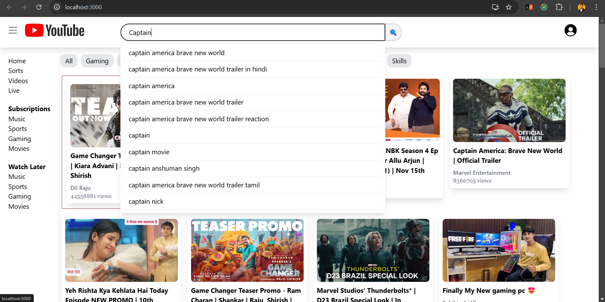

# YouTube Pro

Welcome to the YouTube Clone project! This application replicates key features of YouTube, providing a robust platform for video streaming, live chat, and efficient search functionality.

## Features

- **YouTube Video Streaming**: Integrated YouTube video streaming functionality within the app.
- **Live Stream Chat**: Enabled a live stream chat feature, allowing users to share thoughts in real-time.
- **Optimized Search Functionality**: Engineered an optimized search functionality within the search bar, improving search speed and enhancing user satisfaction.
- **Component Architecture**: Utilized N-level nested components, demonstrating proficiency in component architecture and reducing code complexity.

## Installation

To get started with the project, follow these steps:

1. **Clone the repository**:
   ```sh
   git clone https://github.com/your-username/youtube-clone.git
   ```
2. **Navigate to the project directory**:
   ```sh
   cd youtube-clone
   ```
3. **Install dependencies**:
   ```sh
   npm install
   ```
4. **Start the development server**:
   ```sh
   npm start
   ```

## Usage

After starting the development server, open your browser and go to `http://localhost:3000` to see the YouTube Clone in action.

## Technologies Used

- **Frontend**: React, Tailwind CSS

## Screenshots

_Home Page_


_Search Page_


_Live Chat_


_Nested Comments_

